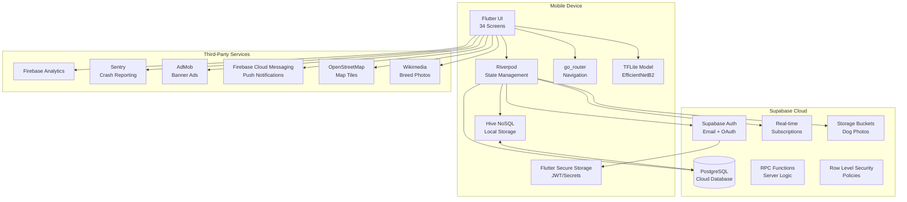

# PRD — DogQuest

**Version:** 1.0
**Date:** March 15, 2026
**Author:** Jesse (founder)
**Status:** Active

---

## 1. Overview

### Product Summary

DogQuest is a Flutter-based mobile app that uses on-device AI to identify 294 dog breeds from a phone camera and wraps the result in a gamified collection system and hyperlocal social network. Users scan dogs, build a breed collection with XP and rarity tiers, connect with nearby dog owners, manage their dog's digital identity, and receive real-time Lost Dog alerts — all within a single app that treats breed discovery as a game worth returning to daily.

The app is already built: 34 screens, 50+ services, a custom-trained EfficientNetB2 model at 87.2% accuracy, full gamification (XP, combos, streaks, mastery, daily challenges, flash challenges, mystery rewards, achievements), and a complete social layer (dog profiles, activity feed, Dogs Nearby, breed communities, Playdate Matcher, Live Map with OSM tiles). The remaining work is backend integration (Supabase for auth, real-time sync, and cloud storage), AdMob integration, and Play Store deployment.

### Objective

Ship DogQuest on the Google Play Store within 90 days, acquire 500+ users, and use the live product as the proof-of-concept to raise $250-500K pre-seed funding for the broader Shazanimal platform ("Shazam for every living creature").

### Market Differentiation

DogQuest sits at an intersection no competitor occupies: **AI identification x deep gamification x local social network**.

- **Dog Scanner** has breed identification but zero gamification and zero social features. Scan, see result, close app.
- **Google Lens** returns "dog" or a generic breed name with no detail, no confidence breakdown, no educational content.
- **Nextdoor** has the local social graph but is not dog-specific — lost pet posts compete with HOA complaints.
- **Instagram/TikTok** has the dog content audience but no structured knowledge layer.

DogQuest's thesis: identification drives the first session, gamification drives the first week, social drives the first month. The combination creates compounding retention that no single-feature competitor can match.

### Magic Moment

The user points their camera at a dog. In under one second, DogQuest identifies the breed with a confidence score, shows fun facts and a rarity tier, awards XP with a visible animation, and adds the breed to their collection. Then the user discovers another DogQuest user nearby and sees their collection. The combination of "it actually works" and "there are other people doing this" is the hook.

### Success Criteria

**Primary Metric: Day 7 Retention Rate**
- Target: 25% (industry average for utility apps: 12-15%; gamified apps: 25-30%)

**Secondary Metrics:**

| Metric | Target | Rationale |
|--------|--------|-----------|
| Day 30 Retention | 12% | Validates social/gamification sustain engagement beyond novelty |
| Scans per User per Week | 3+ | Proves the identification loop is repeatable |
| Social Feature Adoption | 15% of MAU | Validates the local social thesis |
| Average Session Length | 3+ minutes | Above utility-app norms (90s) |
| Play Store Rating | 4.3+ stars | Below 4.0 kills organic discovery |
| Crash-Free Rate | 99.5% | Below 99% triggers negative reviews |

**Leading Indicators:**

| Indicator | Threshold |
|-----------|-----------|
| Camera permission grant rate | >85% |
| Second scan rate (within first session) | >50% |
| Collection screen visits (Day 1) | >60% of users |
| Share action rate | >5% of ID results |
| Re-scan rate (same dog, same session) | <15% (higher = trust problem) |
| Streak maintenance (Day 3+) | >30% of Day 1 users |

---

## 2. Technical Architecture

### Architecture Overview



**Data flow:** The app is local-first. Hive is always the source of truth for reads. Supabase syncs in the background. ML inference runs entirely on-device via TFLite isolate. Social features (feed, dogs nearby, lost dog alerts) require Supabase real-time subscriptions. Offline operation is a first-class citizen — every screen has an offline fallback.

### Chosen Stack

| Layer | Technology | Rationale |
|-------|-----------|-----------|
| Frontend | Flutter (Dart) | Already built. 34 screens, 50+ services. Cross-platform for future iOS. |
| State Management | Riverpod | ConsumerWidget pattern throughout. 8 Providers + 1 StateNotifierProvider. |
| Navigation | go_router | Auth gate + StatefulShellRoute with 5 tabs. |
| Local Storage | Hive + Flutter Secure Storage | Hive for data (prefixed `dogquest_`), FSS for JWT/secrets. AES-encrypted sightings box. |
| Backend | Supabase | Real-time subscriptions, built-in auth, PostgreSQL, file storage, generous free tier (50K MAU). |
| Auth | Supabase Auth | Email/password + OAuth. Replaces current local Hive auth. |
| Database (Cloud) | Supabase PostgreSQL | Shared state: social feed, lost dog reports, user profiles, community data. |
| ML Inference | tflite_flutter 0.11.0 | On-device EfficientNetB2, uint8 quantized, 260x260 input, 10.3 MB. |
| Maps | flutter_map + OSM | Live Map with OpenStreetMap tiles via flutter_map. No Google Maps dependency. |
| Ads | AdMob (google_mobile_ads) | Banner ads on content screens. Never on camera or between scan and result. |
| Analytics | Firebase Analytics | Event tracking, user properties. Project: aviquest-508a6. |
| Crash Reporting | Sentry (sentry_flutter) | Code wired, needs DSN from Sentry project creation. |
| Push Notifications | Firebase Cloud Messaging | Streak reminders, friendship requests, Lost Dog alerts. |

### Stack Integration Guide

**Supabase Flutter Setup:**

```dart
// main.dart — Initialize Supabase before runApp
import 'package:supabase_flutter/supabase_flutter.dart';

Future<void> main() async {
  WidgetsFlutterBinding.ensureInitialized();

  await Supabase.initialize(
    url: const String.fromEnvironment('SUPABASE_URL'),
    anonKey: const String.fromEnvironment('SUPABASE_ANON_KEY'),
  );

  // ... existing Hive init, provider init, runApp
}

// Access client anywhere
final supabase = Supabase.instance.client;
```

**Environment Variables (build-time):**

```bash
flutter build apk --release \
  --dart-define=SUPABASE_URL=https://YOUR_PROJECT.supabase.co \
  --dart-define=SUPABASE_ANON_KEY=YOUR_ANON_KEY \
  --dart-define=SENTRY_DSN=https://YOUR_DSN@sentry.io/PROJECT_ID
```

**Hive + Supabase Hybrid Pattern:**

```dart
// All reads go to Hive first (instant, offline)
// Writes go to Hive immediately, then queue for Supabase sync
class HybridRepository<T> {
  final Box<T> hiveBox;
  final SupabaseClient supabase;
  final String tableName;

  Future<void> save(T item) async {
    await hiveBox.put(item.id, item);        // Local-first
    _queueSync(item);                         // Background sync
  }

  Future<T?> get(String id) async {
    return hiveBox.get(id);                   // Always reads from Hive
  }

  Future<void> _queueSync(T item) async {
    try {
      await supabase.from(tableName).upsert(item.toJson());
    } catch (e) {
      // Queue for retry — add to sync_queue Hive box
      await _syncQueue.add(SyncItem(table: tableName, data: item.toJson()));
    }
  }
}
```

### Repository Structure

```
dogquest/
├── CLAUDE.md                      # Project intelligence
├── Makefile                       # 30+ targets (build, deploy, lint, test, ML, menu)
├── vision.json                    # PLAID product vision intake
├── docs/
│   ├── product-vision.md          # Strategic foundation
│   └── prd.md                     # This document
├── lib/
│   ├── main.dart                  # App entry, provider init, 20+ service wiring
│   ├── constants.dart             # Rarity enum, colors, achievements, breed sets
│   ├── router.dart                # go_router with auth gate & StatefulShellRoute
│   ├── models/                    # 6 models
│   │   ├── dog.dart               # Dog breed data model
│   │   ├── sighting.dart          # Sighting record (breed, location, timestamp)
│   │   ├── player.dart            # Player stats (XP, level, streak, mastery)
│   │   ├── pack.dart              # Pack (family co-ownership)
│   │   ├── my_dog_profile.dart    # User's own dog profile
│   │   └── lost_dog_report.dart   # Lost dog report data
│   ├── screens/                   # 34 screens
│   │   ├── splash_screen.dart
│   │   ├── onboarding_screen.dart
│   │   ├── login_screen.dart
│   │   ├── register_screen.dart
│   │   ├── home_shell.dart
│   │   ├── identify_screen.dart
│   │   ├── kennel_screen.dart
│   │   ├── field_guide_screen.dart
│   │   ├── profile_screen.dart
│   │   ├── map_tab.dart
│   │   ├── settings_screen.dart
│   │   ├── quiz_screen.dart
│   │   ├── breed_detail_screen.dart
│   │   ├── achievements_screen.dart
│   │   ├── leaderboard_screen.dart
│   │   ├── breed_sets_screen.dart
│   │   ├── mastery_screen.dart
│   │   ├── stats_screen.dart
│   │   ├── sighting_history_screen.dart
│   │   ├── dog_passport_screen.dart
│   │   ├── my_dogs_screen.dart
│   │   ├── add_dog_screen.dart
│   │   ├── dog_profile_screen.dart
│   │   ├── pack_screen.dart
│   │   ├── dog_friendships_screen.dart
│   │   ├── neighborhood_map_screen.dart
│   │   ├── lost_dog_screen.dart
│   │   ├── lost_dog_map_screen.dart
│   │   ├── dog_feed_screen.dart
│   │   ├── dogs_nearby_screen.dart
│   │   ├── breed_community_screen.dart
│   │   ├── activity_tracker_screen.dart
│   │   ├── data_consent_screen.dart
│   │   └── privacy_policy_screen.dart
│   ├── services/                  # 50+ services
│   │   ├── tflite_identification_service.dart    # Core ML inference (isolate)
│   │   ├── identification_orchestrator.dart      # Coordinates ML pipeline
│   │   ├── identification_service.dart           # High-level ID interface
│   │   ├── dog_service.dart                      # Breed data, 188+ name aliases
│   │   ├── kennel_service.dart                   # Collection management
│   │   ├── player_service.dart                   # XP, leveling, stats
│   │   ├── sighting_service.dart                 # Sighting records with GPS
│   │   ├── combo_service.dart                    # 24h combo window
│   │   ├── dog_mastery_service.dart              # Per-breed mastery tracking
│   │   ├── daily_challenge_service.dart          # Daily challenge generation
│   │   ├── flash_challenge_service.dart          # Time-limited challenges
│   │   ├── mystery_reward_service.dart           # Mystery bone rewards
│   │   ├── breed_collection_service.dart         # 18 themed breed sets
│   │   ├── dog_group_service.dart                # 7 AKC groups
│   │   ├── pack_service.dart                     # Family co-ownership
│   │   ├── dog_friendship_service.dart           # Dog-to-dog friendships
│   │   ├── dog_social_service.dart               # Social layer logic
│   │   ├── lost_dog_service.dart                 # Lost dog reporting
│   │   ├── lost_dog_alert_service.dart           # Lost dog notifications
│   │   ├── my_dog_service.dart                   # User's own dog management
│   │   ├── daily_dog_service.dart                # Daily featured dog
│   │   ├── dog_embedding_service.dart            # Breed embeddings
│   │   ├── marketplace_service.dart              # Future marketplace
│   │   ├── auth_service.dart                     # Auth (migrate to Supabase)
│   │   ├── api_client.dart                       # HTTP client
│   │   ├── backend_sync_service.dart             # Backend sync
│   │   ├── location_service.dart                 # GPS with 10min cache
│   │   ├── notification_service.dart             # Local notifications
│   │   ├── analytics_service.dart                # Firebase Analytics
│   │   ├── activity_tracker_service.dart         # Activity tracking
│   │   ├── data_consent_service.dart             # GDPR consent
│   │   ├── demo_service.dart                     # Demo mode (26 breeds, 42 sightings)
│   │   ├── haptic_service.dart                   # Haptic feedback
│   │   ├── log_service.dart                      # Logging
│   │   └── quiz_engine.dart                      # Breed quiz logic
│   ├── helpers/
│   │   ├── date_helpers.dart
│   │   ├── game_helpers.dart
│   │   └── ui_helpers.dart
│   └── widgets/                   # 39 widgets
│       ├── capture_button.dart
│       ├── camera_overlay.dart
│       ├── identification_result_card.dart
│       ├── dog_detail_sheet.dart
│       ├── dog_found_dialog.dart
│       ├── dog_passport_card.dart
│       ├── dog_stats_mini.dart
│       ├── breed_share_card.dart
│       ├── breed_share_sheet.dart
│       ├── network_dog_image.dart
│       ├── xp_gain_animation.dart
│       ├── xp_toast.dart
│       ├── level_progress_ring.dart
│       ├── level_up_dialog.dart
│       ├── combo_counter.dart
│       ├── streak_fire_widget.dart
│       ├── streak_break_dialog.dart
│       ├── daily_challenges_card.dart
│       ├── daily_dog_card.dart
│       ├── flash_challenge_banner.dart
│       ├── mystery_bone_reveal.dart
│       ├── weekly_mission_card.dart
│       ├── weekly_pack_report.dart
│       ├── achievement_showcase.dart
│       ├── achievement_unlock_overlay.dart
│       ├── rarity_collection_wheel.dart
│       ├── rarity_discovery_badge.dart
│       ├── rarity_shimmer_badge.dart
│       ├── collection_heatmap.dart
│       ├── personal_insights_card.dart
│       ├── recommended_dogs_strip.dart
│       ├── seasonal_event_banner.dart
│       ├── dog_catch_animation.dart
│       ├── community_pulse.dart
│       ├── playdate_matcher.dart
│       ├── lost_dog_alert_banner.dart
│       ├── lost_dog_poster_card.dart
│       ├── share_dog_card.dart
│       └── data_consent_dialog.dart
├── test/                          # 16 test files
│   ├── dog_test.dart
│   ├── breed_collection_service_test.dart
│   ├── combo_service_test.dart
│   ├── demo_service_test.dart
│   ├── dog_friendship_service_test.dart
│   ├── dog_mastery_service_test.dart
│   ├── dog_service_test.dart
│   ├── kennel_service_test.dart
│   ├── lost_dog_service_test.dart
│   ├── mystery_reward_service_test.dart
│   ├── pack_service_test.dart
│   ├── player_service_test.dart
│   ├── sighting_service_test.dart
│   ├── tflite_identification_service_test.dart
│   ├── quiz_engine_test.dart
│   └── perf_benchmark_test.dart
├── assets/
│   ├── dogs.json                  # 294 breed database (enriched)
│   ├── dog_labels.txt             # 294 breed labels
│   └── dog_model.tflite           # v5.1 model (150 breeds, 10.3 MB)
├── supplemental_dogs/             # 180 breed folders, 42,543 training images
├── train_model_v6.py              # v6 training script (EfficientNetV2-S, 294 breeds)
├── train_model_v5.py              # v5 training script
└── android/                       # Android build configuration
```

### Infrastructure & Deployment

**Supabase Cloud (Free Tier):**
- 50,000 monthly active users
- 500 MB database storage
- 1 GB file storage
- 2 GB bandwidth
- 50,000 auth users
- Real-time subscriptions included
- Edge Functions (if needed)

**Play Store Deployment:**
- App ID: `com.dogquest.app`
- Release signing: keystore needs to be generated (`keytool -genkey -v -keystore dogquest-release.jks -keyalg RSA -keysize 2048 -validity 10000 -alias dogquest`)
- Build command: `flutter build appbundle --release --dart-define=SUPABASE_URL=... --dart-define=SUPABASE_ANON_KEY=...`
- Content rating: IARC questionnaire (user-generated content, location data)
- Target API level: 34 (Android 14)

**Firebase (Free Tier — Spark Plan):**
- Firebase Analytics: unlimited events
- Firebase Cloud Messaging: unlimited push notifications
- No Firestore/Realtime Database usage (Supabase handles this)

### Security Considerations

**Supabase Row Level Security (RLS):**

Every table has RLS enabled. Policies follow the principle of least privilege.

```sql
-- Users can only read/update their own profile
CREATE POLICY "users_own_profile" ON users
  USING (auth.uid() = id);

-- Dog profiles visible to all authenticated users (social feature)
CREATE POLICY "dog_profiles_read" ON dog_profiles
  FOR SELECT USING (auth.role() = 'authenticated');

-- Dog profiles writable only by owner
CREATE POLICY "dog_profiles_write" ON dog_profiles
  FOR ALL USING (auth.uid() = owner_id);

-- Social posts visible to all authenticated users
CREATE POLICY "social_posts_read" ON social_posts
  FOR SELECT USING (auth.role() = 'authenticated');

-- Social posts writable only by author
CREATE POLICY "social_posts_write" ON social_posts
  FOR INSERT WITH CHECK (auth.uid() = user_id);

-- Lost dog reports visible to all (including unauthenticated for public safety)
CREATE POLICY "lost_dog_reports_read" ON lost_dog_reports
  FOR SELECT USING (true);

-- Lost dog reports writable only by owner
CREATE POLICY "lost_dog_reports_write" ON lost_dog_reports
  FOR ALL USING (auth.uid() = user_id);

-- Sightings visible to owner only (private collection)
CREATE POLICY "sightings_own" ON sightings
  USING (auth.uid() = user_id);

-- Friendships visible to both parties
CREATE POLICY "friendships_read" ON friendships
  FOR SELECT USING (
    auth.uid() = requester_dog_owner_id OR
    auth.uid() = recipient_dog_owner_id
  );
```

**Auth Flow:**
- Supabase Auth handles all authentication (email/password, OAuth)
- JWT stored in Flutter Secure Storage (AES-256 encrypted)
- Session refresh handled automatically by supabase_flutter
- Anonymous auth available for browse-before-signup experience

**Local Encryption:**
- Sightings Hive box: AES-encrypted (existing)
- JWT token: Flutter Secure Storage (existing)
- Migration: PII currently in unencrypted Hive box (auth_service.dart:27-30) — moves to Supabase Auth, eliminating local PII storage

### Cost Estimate

| Service | Free Tier Limit | Monthly Cost (0-5K users) | Monthly Cost (5K-50K users) |
|---------|----------------|--------------------------|----------------------------|
| Supabase | 50K MAU, 500MB DB, 1GB storage | $0 | $0 (within free tier) |
| Firebase Analytics | Unlimited | $0 | $0 |
| Firebase Cloud Messaging | Unlimited | $0 | $0 |
| Sentry | 5K errors/month | $0 | $0 (free tier) |
| AdMob Revenue | N/A | +$5-50/month (estimate) | +$50-500/month (estimate) |
| Play Store | $25 one-time | $0 | $0 |
| **Net Monthly Cost** | | **-$5 to -$50 (revenue)** | **-$50 to -$500 (revenue)** |

The entire infrastructure runs on free tiers until well past 50K MAU.

---

## 3. Data Model

### Entity Definitions — Cloud (Supabase PostgreSQL)

```sql
-- ============================================================
-- USERS
-- ============================================================
CREATE TABLE users (
  id UUID PRIMARY KEY DEFAULT auth.uid(),
  email TEXT UNIQUE NOT NULL,
  username TEXT UNIQUE NOT NULL,
  display_name TEXT,
  avatar_id TEXT DEFAULT 'default',
  level INTEGER DEFAULT 1,
  total_xp INTEGER DEFAULT 0,
  total_sightings INTEGER DEFAULT 0,
  kennel_count INTEGER DEFAULT 0,
  current_streak INTEGER DEFAULT 0,
  longest_streak INTEGER DEFAULT 0,
  last_active_date DATE,
  location_sharing_enabled BOOLEAN DEFAULT false,
  approximate_lat DOUBLE PRECISION,
  approximate_lon DOUBLE PRECISION,
  created_at TIMESTAMPTZ DEFAULT now(),
  updated_at TIMESTAMPTZ DEFAULT now()
);

-- ============================================================
-- DOG PROFILES (user's own dogs)
-- ============================================================
CREATE TABLE dog_profiles (
  id UUID PRIMARY KEY DEFAULT gen_random_uuid(),
  owner_id UUID REFERENCES users(id) ON DELETE CASCADE NOT NULL,
  name TEXT NOT NULL,
  breed TEXT NOT NULL,
  breed_secondary TEXT,
  photo_url TEXT,
  date_of_birth DATE,
  weight_kg DOUBLE PRECISION,
  sex TEXT CHECK (sex IN ('male', 'female', 'unknown')),
  is_neutered BOOLEAN,
  bio TEXT,
  temperament_tags TEXT[],
  is_lost BOOLEAN DEFAULT false,
  created_at TIMESTAMPTZ DEFAULT now(),
  updated_at TIMESTAMPTZ DEFAULT now()
);

CREATE INDEX idx_dog_profiles_owner ON dog_profiles(owner_id);
CREATE INDEX idx_dog_profiles_breed ON dog_profiles(breed);
CREATE INDEX idx_dog_profiles_lost ON dog_profiles(is_lost) WHERE is_lost = true;

-- ============================================================
-- SIGHTINGS (breed identifications — synced from local)
-- ============================================================
CREATE TABLE sightings (
  id UUID PRIMARY KEY DEFAULT gen_random_uuid(),
  user_id UUID REFERENCES users(id) ON DELETE CASCADE NOT NULL,
  breed_name TEXT NOT NULL,
  confidence DOUBLE PRECISION NOT NULL,
  top3_breeds JSONB,
  latitude DOUBLE PRECISION,
  longitude DOUBLE PRECISION,
  location_accuracy DOUBLE PRECISION,
  photo_url TEXT,
  xp_earned INTEGER DEFAULT 0,
  is_new_breed BOOLEAN DEFAULT false,
  rarity TEXT CHECK (rarity IN ('common', 'uncommon', 'rare', 'legendary', 'unknown')),
  local_id TEXT,
  created_at TIMESTAMPTZ DEFAULT now()
);

CREATE INDEX idx_sightings_user ON sightings(user_id);
CREATE INDEX idx_sightings_breed ON sightings(breed_name);
CREATE INDEX idx_sightings_created ON sightings(created_at DESC);
CREATE INDEX idx_sightings_local_id ON sightings(local_id);

-- ============================================================
-- SOCIAL POSTS (activity feed)
-- ============================================================
CREATE TABLE social_posts (
  id UUID PRIMARY KEY DEFAULT gen_random_uuid(),
  user_id UUID REFERENCES users(id) ON DELETE CASCADE NOT NULL,
  post_type TEXT NOT NULL CHECK (post_type IN (
    'breed_discovered', 'achievement_unlocked', 'streak_milestone',
    'level_up', 'rare_find', 'set_completed', 'lost_dog_alert',
    'lost_dog_found', 'friendship_formed', 'photo_shared'
  )),
  content TEXT,
  breed_name TEXT,
  photo_url TEXT,
  metadata JSONB DEFAULT '{}',
  like_count INTEGER DEFAULT 0,
  comment_count INTEGER DEFAULT 0,
  is_public BOOLEAN DEFAULT true,
  created_at TIMESTAMPTZ DEFAULT now()
);

CREATE INDEX idx_social_posts_user ON social_posts(user_id);
CREATE INDEX idx_social_posts_type ON social_posts(post_type);
CREATE INDEX idx_social_posts_created ON social_posts(created_at DESC);

-- ============================================================
-- POST LIKES
-- ============================================================
CREATE TABLE post_likes (
  id UUID PRIMARY KEY DEFAULT gen_random_uuid(),
  post_id UUID REFERENCES social_posts(id) ON DELETE CASCADE NOT NULL,
  user_id UUID REFERENCES users(id) ON DELETE CASCADE NOT NULL,
  created_at TIMESTAMPTZ DEFAULT now(),
  UNIQUE(post_id, user_id)
);

-- ============================================================
-- POST COMMENTS
-- ============================================================
CREATE TABLE post_comments (
  id UUID PRIMARY KEY DEFAULT gen_random_uuid(),
  post_id UUID REFERENCES social_posts(id) ON DELETE CASCADE NOT NULL,
  user_id UUID REFERENCES users(id) ON DELETE CASCADE NOT NULL,
  content TEXT NOT NULL,
  created_at TIMESTAMPTZ DEFAULT now()
);

CREATE INDEX idx_post_comments_post ON post_comments(post_id);

-- ============================================================
-- DOG FRIENDSHIPS
-- ============================================================
CREATE TABLE friendships (
  id UUID PRIMARY KEY DEFAULT gen_random_uuid(),
  requester_dog_id UUID REFERENCES dog_profiles(id) ON DELETE CASCADE NOT NULL,
  requester_dog_owner_id UUID REFERENCES users(id) ON DELETE CASCADE NOT NULL,
  recipient_dog_id UUID REFERENCES dog_profiles(id) ON DELETE CASCADE NOT NULL,
  recipient_dog_owner_id UUID REFERENCES users(id) ON DELETE CASCADE NOT NULL,
  status TEXT NOT NULL CHECK (status IN ('pending', 'accepted', 'rejected')) DEFAULT 'pending',
  created_at TIMESTAMPTZ DEFAULT now(),
  accepted_at TIMESTAMPTZ,
  UNIQUE(requester_dog_id, recipient_dog_id)
);

CREATE INDEX idx_friendships_requester ON friendships(requester_dog_owner_id);
CREATE INDEX idx_friendships_recipient ON friendships(recipient_dog_owner_id);
CREATE INDEX idx_friendships_status ON friendships(status);

-- ============================================================
-- LOST DOG REPORTS
-- ============================================================
CREATE TABLE lost_dog_reports (
  id UUID PRIMARY KEY DEFAULT gen_random_uuid(),
  user_id UUID REFERENCES users(id) ON DELETE CASCADE NOT NULL,
  dog_profile_id UUID REFERENCES dog_profiles(id) ON DELETE SET NULL,
  dog_name TEXT NOT NULL,
  breed TEXT NOT NULL,
  photo_url TEXT,
  description TEXT,
  last_seen_lat DOUBLE PRECISION NOT NULL,
  last_seen_lon DOUBLE PRECISION NOT NULL,
  last_seen_at TIMESTAMPTZ NOT NULL,
  contact_info TEXT,
  status TEXT NOT NULL CHECK (status IN ('active', 'found', 'cancelled')) DEFAULT 'active',
  alert_radius_miles DOUBLE PRECISION DEFAULT 5.0,
  created_at TIMESTAMPTZ DEFAULT now(),
  resolved_at TIMESTAMPTZ
);

CREATE INDEX idx_lost_dog_reports_status ON lost_dog_reports(status) WHERE status = 'active';
CREATE INDEX idx_lost_dog_reports_location ON lost_dog_reports USING GIST (
  ST_SetSRID(ST_MakePoint(last_seen_lon, last_seen_lat), 4326)
);

-- ============================================================
-- LOST DOG SIGHTINGS (community reports of spotted lost dogs)
-- ============================================================
CREATE TABLE lost_dog_sightings (
  id UUID PRIMARY KEY DEFAULT gen_random_uuid(),
  report_id UUID REFERENCES lost_dog_reports(id) ON DELETE CASCADE NOT NULL,
  reporter_id UUID REFERENCES users(id) ON DELETE CASCADE NOT NULL,
  latitude DOUBLE PRECISION NOT NULL,
  longitude DOUBLE PRECISION NOT NULL,
  note TEXT,
  created_at TIMESTAMPTZ DEFAULT now()
);

CREATE INDEX idx_lost_dog_sightings_report ON lost_dog_sightings(report_id);

-- ============================================================
-- BREED COMMUNITIES
-- ============================================================
CREATE TABLE breed_communities (
  breed_name TEXT PRIMARY KEY,
  member_count INTEGER DEFAULT 0,
  post_count INTEGER DEFAULT 0,
  description TEXT,
  created_at TIMESTAMPTZ DEFAULT now()
);

-- ============================================================
-- BREED COMMUNITY MEMBERSHIPS
-- ============================================================
CREATE TABLE breed_community_memberships (
  id UUID PRIMARY KEY DEFAULT gen_random_uuid(),
  breed_name TEXT REFERENCES breed_communities(breed_name) ON DELETE CASCADE NOT NULL,
  user_id UUID REFERENCES users(id) ON DELETE CASCADE NOT NULL,
  created_at TIMESTAMPTZ DEFAULT now(),
  UNIQUE(breed_name, user_id)
);

-- ============================================================
-- BREED COMMUNITY POSTS
-- ============================================================
CREATE TABLE breed_community_posts (
  id UUID PRIMARY KEY DEFAULT gen_random_uuid(),
  breed_name TEXT REFERENCES breed_communities(breed_name) ON DELETE CASCADE NOT NULL,
  user_id UUID REFERENCES users(id) ON DELETE CASCADE NOT NULL,
  content TEXT NOT NULL,
  photo_url TEXT,
  like_count INTEGER DEFAULT 0,
  created_at TIMESTAMPTZ DEFAULT now()
);

CREATE INDEX idx_breed_community_posts_breed ON breed_community_posts(breed_name);

-- ============================================================
-- PLAYDATES
-- ============================================================
CREATE TABLE playdates (
  id UUID PRIMARY KEY DEFAULT gen_random_uuid(),
  organizer_id UUID REFERENCES users(id) ON DELETE CASCADE NOT NULL,
  organizer_dog_id UUID REFERENCES dog_profiles(id) ON DELETE CASCADE NOT NULL,
  location_name TEXT NOT NULL,
  latitude DOUBLE PRECISION NOT NULL,
  longitude DOUBLE PRECISION NOT NULL,
  scheduled_at TIMESTAMPTZ NOT NULL,
  max_dogs INTEGER DEFAULT 5,
  description TEXT,
  status TEXT NOT NULL CHECK (status IN ('upcoming', 'ongoing', 'completed', 'cancelled')) DEFAULT 'upcoming',
  created_at TIMESTAMPTZ DEFAULT now()
);

CREATE INDEX idx_playdates_scheduled ON playdates(scheduled_at) WHERE status = 'upcoming';

-- ============================================================
-- PLAYDATE RSVPS
-- ============================================================
CREATE TABLE playdate_rsvps (
  id UUID PRIMARY KEY DEFAULT gen_random_uuid(),
  playdate_id UUID REFERENCES playdates(id) ON DELETE CASCADE NOT NULL,
  user_id UUID REFERENCES users(id) ON DELETE CASCADE NOT NULL,
  dog_id UUID REFERENCES dog_profiles(id) ON DELETE CASCADE NOT NULL,
  status TEXT NOT NULL CHECK (status IN ('going', 'maybe', 'declined')) DEFAULT 'going',
  created_at TIMESTAMPTZ DEFAULT now(),
  UNIQUE(playdate_id, dog_id)
);

-- ============================================================
-- USER BLOCKS (moderation)
-- ============================================================
CREATE TABLE user_blocks (
  id UUID PRIMARY KEY DEFAULT gen_random_uuid(),
  blocker_id UUID REFERENCES users(id) ON DELETE CASCADE NOT NULL,
  blocked_id UUID REFERENCES users(id) ON DELETE CASCADE NOT NULL,
  created_at TIMESTAMPTZ DEFAULT now(),
  UNIQUE(blocker_id, blocked_id)
);

-- ============================================================
-- CONTENT REPORTS (moderation)
-- ============================================================
CREATE TABLE content_reports (
  id UUID PRIMARY KEY DEFAULT gen_random_uuid(),
  reporter_id UUID REFERENCES users(id) ON DELETE CASCADE NOT NULL,
  content_type TEXT NOT NULL CHECK (content_type IN ('social_post', 'comment', 'dog_profile', 'community_post')),
  content_id UUID NOT NULL,
  reason TEXT NOT NULL CHECK (reason IN ('spam', 'harassment', 'inappropriate', 'misinformation', 'other')),
  description TEXT,
  status TEXT NOT NULL CHECK (status IN ('pending', 'reviewed', 'actioned', 'dismissed')) DEFAULT 'pending',
  created_at TIMESTAMPTZ DEFAULT now()
);

-- ============================================================
-- PACKS (family co-ownership)
-- ============================================================
CREATE TABLE packs (
  id UUID PRIMARY KEY DEFAULT gen_random_uuid(),
  name TEXT NOT NULL,
  created_by UUID REFERENCES users(id) ON DELETE CASCADE NOT NULL,
  invite_code TEXT UNIQUE NOT NULL,
  created_at TIMESTAMPTZ DEFAULT now()
);

CREATE TABLE pack_members (
  id UUID PRIMARY KEY DEFAULT gen_random_uuid(),
  pack_id UUID REFERENCES packs(id) ON DELETE CASCADE NOT NULL,
  user_id UUID REFERENCES users(id) ON DELETE CASCADE NOT NULL,
  role TEXT NOT NULL CHECK (role IN ('owner', 'member')) DEFAULT 'member',
  joined_at TIMESTAMPTZ DEFAULT now(),
  UNIQUE(pack_id, user_id)
);

CREATE TABLE pack_dogs (
  id UUID PRIMARY KEY DEFAULT gen_random_uuid(),
  pack_id UUID REFERENCES packs(id) ON DELETE CASCADE NOT NULL,
  dog_id UUID REFERENCES dog_profiles(id) ON DELETE CASCADE NOT NULL,
  UNIQUE(pack_id, dog_id)
);

-- ============================================================
-- FOLLOWS (user follows user)
-- ============================================================
CREATE TABLE follows (
  id UUID PRIMARY KEY DEFAULT gen_random_uuid(),
  follower_id UUID REFERENCES users(id) ON DELETE CASCADE NOT NULL,
  following_id UUID REFERENCES users(id) ON DELETE CASCADE NOT NULL,
  created_at TIMESTAMPTZ DEFAULT now(),
  UNIQUE(follower_id, following_id)
);

CREATE INDEX idx_follows_follower ON follows(follower_id);
CREATE INDEX idx_follows_following ON follows(following_id);
```

### Entity Definitions — Local (Hive NoSQL)

| Hive Box | Key Type | Value Type | Purpose |
|----------|---------|------------|---------|
| `dogquest_player_stats` | String (single key: `player`) | Player JSON | XP, level, streak, mastery, achievements, combo state |
| `dogquest_kennel` | String (breed name) | Dog JSON | Discovered breeds collection |
| `dogquest_sightings_v1` | Auto-increment int | Sighting JSON | All sighting records (AES-encrypted box) |
| `dogquest_analytics_events` | Auto-increment int | Event JSON | Queued analytics events |
| `dogquest_sync_queue` | Auto-increment int | SyncItem JSON | **NEW** — Pending Supabase sync operations |
| `dogquest_my_dogs` | String (dog ID) | MyDogProfile JSON | User's own dog profiles |
| `dogquest_packs` | String (pack ID) | Pack JSON | Pack membership data |
| `dogquest_friendships` | String (friendship ID) | Friendship JSON | Dog friendship records |
| `dogquest_lost_dogs` | String (report ID) | LostDogReport JSON | Lost dog reports |

### Relationships

```
users 1──* dog_profiles         (owner has dogs)
users 1──* sightings            (user makes sightings)
users 1──* social_posts         (user creates posts)
users *──* users                (follows)
users *──* users                (blocks)

dog_profiles *──* dog_profiles  (friendships, via friendships table)
dog_profiles *──* playdates     (RSVPs)
dog_profiles 1──? lost_dog_reports (dog may be lost)

social_posts 1──* post_likes    (post has likes)
social_posts 1──* post_comments (post has comments)

breed_communities 1──* breed_community_posts
breed_communities *──* users    (memberships)

packs *──* users                (pack_members)
packs *──* dog_profiles         (pack_dogs)

lost_dog_reports 1──* lost_dog_sightings (community sighting reports)
```

### Indexes

All indexes are defined inline with the table definitions above. Key performance indexes:

| Table | Index | Purpose |
|-------|-------|---------|
| sightings | `idx_sightings_user` | Fast lookup of user's sightings |
| sightings | `idx_sightings_created` | Feed ordering by recency |
| sightings | `idx_sightings_local_id` | Deduplication during Hive sync |
| social_posts | `idx_social_posts_created` | Feed pagination |
| dog_profiles | `idx_dog_profiles_owner` | User's dogs lookup |
| dog_profiles | `idx_dog_profiles_lost` | Active lost dog queries (partial index) |
| friendships | `idx_friendships_status` | Pending request queries |
| lost_dog_reports | GIST spatial index | Geo-proximity queries for nearby alerts |
| playdates | `idx_playdates_scheduled` | Upcoming playdate queries (partial index) |

---

## 4. API Specification

### API Design Philosophy

DogQuest uses Supabase as a Backend-as-a-Service. There is no custom REST API. All data access goes through:

1. **Supabase Client Queries** — Direct table reads/writes via `supabase.from('table')`, protected by RLS
2. **Supabase RPC Functions** — Server-side PostgreSQL functions for complex operations
3. **Supabase Real-time Subscriptions** — Live updates for social feed, lost dog alerts, friendship requests
4. **Supabase Storage** — File uploads for dog photos, sighting photos

### Supabase RPC Functions

```sql
-- ============================================================
-- Feed: Get paginated social feed for a user
-- ============================================================
CREATE OR REPLACE FUNCTION get_feed(
  p_user_id UUID,
  p_limit INTEGER DEFAULT 20,
  p_cursor TIMESTAMPTZ DEFAULT NULL
)
RETURNS TABLE (
  id UUID,
  user_id UUID,
  username TEXT,
  display_name TEXT,
  avatar_id TEXT,
  post_type TEXT,
  content TEXT,
  breed_name TEXT,
  photo_url TEXT,
  metadata JSONB,
  like_count INTEGER,
  comment_count INTEGER,
  user_has_liked BOOLEAN,
  created_at TIMESTAMPTZ
) AS $$
BEGIN
  RETURN QUERY
  SELECT
    sp.id,
    sp.user_id,
    u.username,
    u.display_name,
    u.avatar_id,
    sp.post_type,
    sp.content,
    sp.breed_name,
    sp.photo_url,
    sp.metadata,
    sp.like_count,
    sp.comment_count,
    EXISTS(SELECT 1 FROM post_likes pl WHERE pl.post_id = sp.id AND pl.user_id = p_user_id) AS user_has_liked,
    sp.created_at
  FROM social_posts sp
  JOIN users u ON u.id = sp.user_id
  LEFT JOIN user_blocks ub ON ub.blocker_id = p_user_id AND ub.blocked_id = sp.user_id
  WHERE sp.is_public = true
    AND ub.id IS NULL
    AND (p_cursor IS NULL OR sp.created_at < p_cursor)
  ORDER BY sp.created_at DESC
  LIMIT p_limit;
END;
$$ LANGUAGE plpgsql SECURITY DEFINER;

-- ============================================================
-- Dogs Nearby: Find dogs within a radius
-- ============================================================
CREATE OR REPLACE FUNCTION get_dogs_nearby(
  p_user_id UUID,
  p_lat DOUBLE PRECISION,
  p_lon DOUBLE PRECISION,
  p_radius_miles DOUBLE PRECISION DEFAULT 5.0,
  p_limit INTEGER DEFAULT 50
)
RETURNS TABLE (
  dog_id UUID,
  dog_name TEXT,
  breed TEXT,
  photo_url TEXT,
  owner_username TEXT,
  owner_display_name TEXT,
  distance_miles DOUBLE PRECISION
) AS $$
BEGIN
  RETURN QUERY
  SELECT
    dp.id AS dog_id,
    dp.name AS dog_name,
    dp.breed,
    dp.photo_url,
    u.username AS owner_username,
    u.display_name AS owner_display_name,
    (
      3959 * acos(
        cos(radians(p_lat)) * cos(radians(u.approximate_lat))
        * cos(radians(u.approximate_lon) - radians(p_lon))
        + sin(radians(p_lat)) * sin(radians(u.approximate_lat))
      )
    ) AS distance_miles
  FROM dog_profiles dp
  JOIN users u ON u.id = dp.owner_id
  LEFT JOIN user_blocks ub ON (ub.blocker_id = p_user_id AND ub.blocked_id = dp.owner_id)
    OR (ub.blocker_id = dp.owner_id AND ub.blocked_id = p_user_id)
  WHERE u.location_sharing_enabled = true
    AND u.id != p_user_id
    AND ub.id IS NULL
    AND u.approximate_lat IS NOT NULL
    AND u.approximate_lon IS NOT NULL
    AND (
      3959 * acos(
        cos(radians(p_lat)) * cos(radians(u.approximate_lat))
        * cos(radians(u.approximate_lon) - radians(p_lon))
        + sin(radians(p_lat)) * sin(radians(u.approximate_lat))
      )
    ) <= p_radius_miles
  ORDER BY distance_miles ASC
  LIMIT p_limit;
END;
$$ LANGUAGE plpgsql SECURITY DEFINER;

-- ============================================================
-- Active Lost Dogs: Find lost dogs near a location
-- ============================================================
CREATE OR REPLACE FUNCTION get_active_lost_dogs(
  p_lat DOUBLE PRECISION,
  p_lon DOUBLE PRECISION,
  p_radius_miles DOUBLE PRECISION DEFAULT 10.0
)
RETURNS TABLE (
  id UUID,
  dog_name TEXT,
  breed TEXT,
  photo_url TEXT,
  description TEXT,
  last_seen_lat DOUBLE PRECISION,
  last_seen_lon DOUBLE PRECISION,
  last_seen_at TIMESTAMPTZ,
  distance_miles DOUBLE PRECISION,
  sighting_count BIGINT,
  created_at TIMESTAMPTZ
) AS $$
BEGIN
  RETURN QUERY
  SELECT
    ldr.id,
    ldr.dog_name,
    ldr.breed,
    ldr.photo_url,
    ldr.description,
    ldr.last_seen_lat,
    ldr.last_seen_lon,
    ldr.last_seen_at,
    (
      3959 * acos(
        cos(radians(p_lat)) * cos(radians(ldr.last_seen_lat))
        * cos(radians(ldr.last_seen_lon) - radians(p_lon))
        + sin(radians(p_lat)) * sin(radians(ldr.last_seen_lat))
      )
    ) AS distance_miles,
    (SELECT count(*) FROM lost_dog_sightings lds WHERE lds.report_id = ldr.id) AS sighting_count,
    ldr.created_at
  FROM lost_dog_reports ldr
  WHERE ldr.status = 'active'
    AND (
      3959 * acos(
        cos(radians(p_lat)) * cos(radians(ldr.last_seen_lat))
        * cos(radians(ldr.last_seen_lon) - radians(p_lon))
        + sin(radians(p_lat)) * sin(radians(ldr.last_seen_lat))
      )
    ) <= p_radius_miles
  ORDER BY ldr.created_at DESC;
END;
$$ LANGUAGE plpgsql SECURITY DEFINER;

-- ============================================================
-- Sync sightings: Upsert from local Hive data
-- ============================================================
CREATE OR REPLACE FUNCTION sync_sightings(
  p_sightings JSONB
)
RETURNS INTEGER AS $$
DECLARE
  v_count INTEGER := 0;
  v_sighting JSONB;
BEGIN
  FOR v_sighting IN SELECT * FROM jsonb_array_elements(p_sightings)
  LOOP
    INSERT INTO sightings (
      user_id, breed_name, confidence, top3_breeds,
      latitude, longitude, location_accuracy,
      xp_earned, is_new_breed, rarity, local_id, created_at
    ) VALUES (
      auth.uid(),
      v_sighting->>'breed_name',
      (v_sighting->>'confidence')::DOUBLE PRECISION,
      v_sighting->'top3_breeds',
      (v_sighting->>'latitude')::DOUBLE PRECISION,
      (v_sighting->>'longitude')::DOUBLE PRECISION,
      (v_sighting->>'location_accuracy')::DOUBLE PRECISION,
      (v_sighting->>'xp_earned')::INTEGER,
      (v_sighting->>'is_new_breed')::BOOLEAN,
      v_sighting->>'rarity',
      v_sighting->>'local_id',
      (v_sighting->>'created_at')::TIMESTAMPTZ
    )
    ON CONFLICT (local_id) WHERE local_id IS NOT NULL
    DO NOTHING;
    v_count := v_count + 1;
  END LOOP;
  RETURN v_count;
END;
$$ LANGUAGE plpgsql SECURITY DEFINER;

-- ============================================================
-- Leaderboard: Top users by XP
-- ============================================================
CREATE OR REPLACE FUNCTION get_leaderboard(
  p_limit INTEGER DEFAULT 50
)
RETURNS TABLE (
  rank BIGINT,
  user_id UUID,
  username TEXT,
  display_name TEXT,
  avatar_id TEXT,
  level INTEGER,
  total_xp INTEGER,
  kennel_count INTEGER
) AS $$
BEGIN
  RETURN QUERY
  SELECT
    ROW_NUMBER() OVER (ORDER BY u.total_xp DESC) AS rank,
    u.id AS user_id,
    u.username,
    u.display_name,
    u.avatar_id,
    u.level,
    u.total_xp,
    u.kennel_count
  FROM users u
  ORDER BY u.total_xp DESC
  LIMIT p_limit;
END;
$$ LANGUAGE plpgsql SECURITY DEFINER;
```

### Real-time Channels

```dart
// Social feed — new posts from followed users
supabase
  .from('social_posts')
  .stream(primaryKey: ['id'])
  .order('created_at', ascending: false)
  .limit(20)
  .listen((posts) {
    // Update feed state
  });

// Lost dog alerts — active reports near user
supabase
  .from('lost_dog_reports')
  .stream(primaryKey: ['id'])
  .eq('status', 'active')
  .listen((reports) {
    // Show alert banner, update map
  });

// Friendship requests — pending for current user
supabase
  .from('friendships')
  .stream(primaryKey: ['id'])
  .eq('recipient_dog_owner_id', userId)
  .eq('status', 'pending')
  .listen((requests) {
    // Show notification badge
  });

// Lost dog sighting updates — for report owner
supabase
  .from('lost_dog_sightings')
  .stream(primaryKey: ['id'])
  .eq('report_id', reportId)
  .listen((sightings) {
    // Update map pins in real-time
  });
```

### Storage Buckets

| Bucket | Access | Max File Size | Allowed Types | Purpose |
|--------|--------|---------------|---------------|---------|
| `dog-photos` | Authenticated read/write (own files) | 5 MB | image/jpeg, image/png, image/webp | Dog profile photos |
| `sighting-photos` | Authenticated read/write (own files) | 5 MB | image/jpeg, image/png | Sighting capture photos |
| `lost-dog-photos` | Public read, authenticated write | 5 MB | image/jpeg, image/png | Lost dog report photos |
| `community-photos` | Authenticated read/write | 5 MB | image/jpeg, image/png | Breed community post photos |

```dart
// Upload dog photo
final file = File(imagePath);
final fileName = '${userId}/${dogId}_${DateTime.now().millisecondsSinceEpoch}.jpg';
await supabase.storage.from('dog-photos').upload(fileName, file);
final publicUrl = supabase.storage.from('dog-photos').getPublicUrl(fileName);
```

---

## 5. User Stories

### Breed Identification

| ID | As a... | I want to... | So that... | Priority |
|----|---------|-------------|-----------|----------|
| US-ID-01 | Dog walker | Point my camera at a dog and get its breed identified instantly | I can learn what breed it is | P0 |
| US-ID-02 | Dog walker | See a confidence score and top-3 alternative breeds | I can judge how reliable the result is | P0 |
| US-ID-03 | Dog walker | See fun facts, origin, and temperament after identification | I learn something interesting about the breed | P0 |
| US-ID-04 | Dog owner | Upload a photo from my gallery for identification | I can identify breeds from saved photos | P0 |
| US-ID-05 | Dog walker | Get identification results while offline | I can use the app at the park without WiFi | P0 |
| US-ID-06 | Dog walker | Provide feedback when the breed ID is wrong | The model can improve over time | P1 |

### Collection & Gamification

| ID | As a... | I want to... | So that... | Priority |
|----|---------|-------------|-----------|----------|
| US-CG-01 | Breed collector | See my collection of discovered breeds in a kennel | I can track my progress toward 294 | P0 |
| US-CG-02 | Player | Earn XP for every breed I scan | I feel rewarded for exploring | P0 |
| US-CG-03 | Player | Maintain a daily streak by scanning at least one dog per day | I have a reason to come back daily | P0 |
| US-CG-04 | Player | Chain discoveries within 24 hours for combo bonuses | I'm motivated to scan multiple dogs per session | P0 |
| US-CG-05 | Player | Complete daily challenges (e.g., "scan a Sporting breed") | I have specific goals each day | P0 |
| US-CG-06 | Player | Respond to flash challenges (time-limited, surprise events) | I feel urgency and excitement | P1 |
| US-CG-07 | Player | Unlock mystery bone rewards after milestones | I get pleasant surprises | P1 |
| US-CG-08 | Breed nerd | Build mastery on specific breeds by scanning them multiple times | I can become an expert on my favorite breeds | P1 |
| US-CG-09 | Collector | Complete themed breed sets (Snow Pack, Tiny Titans) | I have a themed goal beyond "catch them all" | P1 |
| US-CG-10 | Competitor | See my rank on neighborhood, city, and global leaderboards | I can compete with other users | P2 |
| US-CG-11 | Player | Unlock achievements for milestones (first rare, all 7 groups) | I have long-term goals to work toward | P0 |

### Social

| ID | As a... | I want to... | So that... | Priority |
|----|---------|-------------|-----------|----------|
| US-SO-01 | Dog owner | Create a profile for my dog with name, breed, and photo | Other users can see my dog | P0 |
| US-SO-02 | Dog owner | See an activity feed of recent discoveries and achievements | I feel connected to the community | P0 |
| US-SO-03 | Dog owner | See dogs nearby on a map or list | I can find other dog owners in my area | P0 |
| US-SO-04 | Dog owner | Join breed-specific communities | I can connect with owners of the same breed | P1 |
| US-SO-05 | Dog owner | Like and comment on social feed posts | I can interact with other users | P1 |
| US-SO-06 | Dog owner | Follow other users to see their activity | I can build a personalized feed | P1 |
| US-SO-07 | User | Report or block another user | I can protect myself from harassment | P0 |
| US-SO-08 | Dog owner | Share my breed ID results to Instagram/TikTok | I can show off my discoveries | P2 |

### Pack & Friendships

| ID | As a... | I want to... | So that... | Priority |
|----|---------|-------------|-----------|----------|
| US-PF-01 | Family member | Create a Pack and invite family members via code | We can co-manage our dog's profile | P1 |
| US-PF-02 | Dog owner | Send and accept friendship requests between dogs | My dog has a social network | P1 |
| US-PF-03 | Dog owner | See my dog's friends on a neighborhood map | I know where my dog's friends are | P1 |
| US-PF-04 | Dog owner | Use the Playdate Matcher to find compatible dogs | My dog can meet new friends | P2 |
| US-PF-05 | Dog owner | Generate a shareable Dog Passport card | I can share my dog's identity | P1 |

### Lost Dog

| ID | As a... | I want to... | So that... | Priority |
|----|---------|-------------|-----------|----------|
| US-LD-01 | Dog owner | Report my dog as lost with photo, description, last location | The community can help find them | P0 |
| US-LD-02 | Nearby user | Receive a push notification when a dog is lost near me | I can keep an eye out | P0 |
| US-LD-03 | Helper | Tap "I've Seen This Dog" and drop a pin on the map | The owner gets real-time location updates | P0 |
| US-LD-04 | Dog owner | Mark my dog as found and notify everyone who helped | The community knows the outcome | P0 |
| US-LD-05 | User | See active lost dog reports on the Live Map | I have a map-based view of missing dogs | P1 |

### Profile & Settings

| ID | As a... | I want to... | So that... | Priority |
|----|---------|-------------|-----------|----------|
| US-PR-01 | User | Create an account with email/password or OAuth | My data persists across devices | P0 |
| US-PR-02 | User | See my stats (level, XP, streak, kennel count) on my profile | I can track my progress at a glance | P0 |
| US-PR-03 | User | Customize my avatar from unlockable options | I can personalize my identity | P1 |
| US-PR-04 | User | Control location sharing granularity (off, approximate, precise) | I have privacy control | P0 |
| US-PR-05 | User | Enable/disable push notification categories | I control what notifications I receive | P1 |
| US-PR-06 | User | Activate demo mode from Settings | I can try the app with pre-seeded data | P1 |
| US-PR-07 | User | View and manage GDPR data consent | I understand what data is collected | P0 |

---

## 6. Functional Requirements

### Breed Identification

| ID | Requirement | Priority | Status |
|----|------------|----------|--------|
| FR-001 | The app shall identify dog breeds from camera capture using on-device TFLite inference | P0 | Built |
| FR-002 | The app shall display breed name, confidence percentage, and top-3 alternatives on the result screen | P0 | Built |
| FR-003 | The app shall support photo upload from device gallery for identification | P0 | Built |
| FR-004 | ML inference shall run in a Dart isolate to prevent UI jank | P0 | Built |
| FR-005 | The app shall apply EXIF orientation correction, center-crop to square, and resize to model input size (260x260 for v5, 300x300 for v6) before inference | P0 | Built |
| FR-006 | v5 inference shall use 5-crop TTA (center + 4 corners) x flip = 10 variants averaged | P0 | Built |
| FR-007 | Results below 40% confidence shall display "We're not sure" with alternatives | P0 | Built |
| FR-008 | Camera shall fully dispose and reinitialize after each capture (no resumePreview) | P0 | Built |
| FR-009 | The app shall support 294 breed labels with 188+ name aliases mapping model output to display names | P0 | Built |
| FR-010 | Non-dog photos shall be handled gracefully with humor ("+5 XP for trying") | P1 | Built |

### Gamification

| ID | Requirement | Priority | Status |
|----|------------|----------|--------|
| FR-011 | The app shall award XP for each breed identification, scaled by rarity tier | P0 | Built |
| FR-012 | The app shall track daily streaks (minimum 1 scan per day to maintain) | P0 | Built |
| FR-013 | The app shall support combos: multiple discoveries within a 24-hour window award bonus XP | P0 | Built |
| FR-014 | The app shall provide daily challenges that refresh every 24 hours | P0 | Built |
| FR-015 | The app shall support flash challenges (time-limited surprise events) | P1 | Built |
| FR-016 | The app shall award mystery bone rewards after milestone discoveries | P1 | Built |
| FR-017 | The app shall track per-breed mastery (repeated scans increase mastery level) | P1 | Built |
| FR-018 | The app shall support 18 themed breed sets (Snow Pack, Tiny Titans, etc.) with set completion rewards | P1 | Built |
| FR-019 | The app shall classify 294 breeds into 4 rarity tiers: 173 common, 77 uncommon, 34 rare, 10 legendary | P0 | Built |
| FR-020 | The app shall support unlockable avatars tied to level, kennel count, achievements, streak, and sightings | P1 | Built |
| FR-021 | The app shall track and display player level, title, and XP progress | P0 | Built |
| FR-022 | The app shall support achievement unlocking with overlay animation | P0 | Built |

### Social Layer

| ID | Requirement | Priority | Status |
|----|------------|----------|--------|
| FR-023 | The app shall display a social activity feed with posts from other users | P0 | Built (local), needs Supabase |
| FR-024 | The app shall show dogs nearby based on user location (opt-in) | P0 | Built (local), needs Supabase |
| FR-025 | The app shall support breed-specific communities with posts | P1 | Built (local), needs Supabase |
| FR-026 | The app shall support Playdate Matcher to find compatible dogs | P2 | Built (local), needs Supabase |
| FR-027 | The app shall display a Live Map with OSM tiles showing dogs, lost dog reports, and playdates | P0 | Built |
| FR-028 | Social posts shall be created automatically for: breed discoveries, achievements, streak milestones, level ups, rare finds, set completions | P0 | Built (local), needs Supabase |
| FR-029 | Users shall be able to like and comment on social posts | P1 | Needs Supabase |
| FR-030 | Users shall be able to follow other users | P1 | Needs Supabase |
| FR-031 | Users shall be able to report and block other users | P0 | Needs Supabase |

### Pack & Friendships

| ID | Requirement | Priority | Status |
|----|------------|----------|--------|
| FR-032 | The app shall support Pack creation with invite codes for family co-ownership | P1 | Built (local), needs Supabase |
| FR-033 | The app shall support dog-to-dog friendship requests (send, accept, reject) | P1 | Built (local), needs Supabase |
| FR-034 | Dog friendships shall display on the neighborhood map with connection lines | P1 | Built |
| FR-035 | The app shall generate shareable Dog Passport cards | P1 | Built |

### Lost Dog

| ID | Requirement | Priority | Status |
|----|------------|----------|--------|
| FR-036 | Users shall be able to report a dog as lost with photo, description, and GPS coordinates | P0 | Built (local), needs Supabase |
| FR-037 | Lost dog alerts shall broadcast as push notifications to users within the alert radius | P0 | Needs Supabase + FCM |
| FR-038 | Community members shall be able to report sightings of a lost dog with GPS pin drops | P0 | Built (local), needs Supabase |
| FR-039 | The owner's map shall update in real-time with community sighting pins | P0 | Needs Supabase real-time |
| FR-040 | Owners shall be able to resolve a lost dog report, notifying all helpers | P0 | Needs Supabase |

### Auth & User Management

| ID | Requirement | Priority | Status |
|----|------------|----------|--------|
| FR-041 | The app shall support Supabase Auth with email/password registration and login | P0 | Needs Supabase |
| FR-042 | The app shall support OAuth login (Google, Apple) via Supabase Auth | P1 | Needs Supabase |
| FR-043 | The app shall migrate from local Hive auth to Supabase Auth | P0 | Needs implementation |
| FR-044 | Session tokens shall be stored in Flutter Secure Storage | P0 | Partially built |
| FR-045 | The app shall support anonymous browsing before account creation | P1 | Needs implementation |
| FR-046 | Protected routes shall redirect unauthenticated users to login via go_router | P0 | Built (needs Supabase adapter) |

### Data Sync

| ID | Requirement | Priority | Status |
|----|------------|----------|--------|
| FR-047 | The app shall sync local Hive sightings to Supabase PostgreSQL in the background | P0 | Needs implementation |
| FR-048 | Sync shall use optimistic local-first writes: Hive is always the read source, Supabase syncs behind | P0 | Needs implementation |
| FR-049 | Failed sync operations shall be queued in a `sync_queue` Hive box and retried with exponential backoff | P0 | Needs implementation |
| FR-050 | Sighting deduplication shall use `local_id` to prevent duplicate cloud records | P0 | Needs implementation |
| FR-051 | First-time Supabase connection shall bulk-upload all existing local sightings | P0 | Needs implementation |

### Monetization

| ID | Requirement | Priority | Status |
|----|------------|----------|--------|
| FR-052 | The app shall display AdMob banner ads on content screens (feed, collection, breed info) | P0 | Needs implementation |
| FR-053 | Ads shall never appear on the camera screen or between scan and result | P0 | N/A (constraint) |
| FR-054 | Interstitial ads shall be capped at 1 per 5-minute session | P1 | Needs implementation |
| FR-055 | GDPR consent shall be collected before showing personalized ads | P0 | Partially built (consent dialog exists) |

### Demo Mode

| ID | Requirement | Priority | Status |
|----|------------|----------|--------|
| FR-056 | The app shall support a demo mode with 26 pre-seeded breeds and 42 sightings | P1 | Built |
| FR-057 | Demo mode shall be activatable from the Settings screen | P1 | Built |

---

## 7. Non-Functional Requirements

### Performance

| ID | Requirement | Target | Measurement |
|----|------------|--------|-------------|
| NFR-001 | ML inference latency | <2s on mid-range Android (2020+) | Timed in isolate, logged to analytics |
| NFR-002 | App cold start to camera ready | <3s | Time from launch to camera preview rendering |
| NFR-003 | Camera capture to result screen | <2s | Time from shutter tap to result display |
| NFR-004 | Feed load time (Supabase) | <1s on 4G | Time from screen open to first post rendered |
| NFR-005 | Local data read (Hive) | <50ms | All Hive reads should feel instant |
| NFR-006 | App size (APK) | <50 MB | Measured with `flutter build apk --analyze-size` |
| NFR-007 | Memory usage | <200 MB peak | Profiled with Flutter DevTools |
| NFR-008 | Frame rate | 60 FPS during scrolling | No jank frames in feed, collection, or map |

### Security

| ID | Requirement |
|----|------------|
| NFR-009 | All Supabase tables shall have Row Level Security enabled |
| NFR-010 | JWT tokens shall be stored in Flutter Secure Storage (AES-256) |
| NFR-011 | No PII shall be stored in unencrypted local storage after Supabase migration |
| NFR-012 | API keys (Supabase anon key, Sentry DSN) shall be injected via `--dart-define`, never hardcoded |
| NFR-013 | Dog photo uploads shall be scanned for EXIF GPS data and stripped before storage |
| NFR-014 | User location shall be rounded to neighborhood level (3 decimal places, ~110m precision) for the "approximate" setting |

### Accessibility

| ID | Requirement |
|----|------------|
| NFR-015 | All interactive elements shall have minimum 48x48dp touch targets |
| NFR-016 | All images shall have `semanticsLabel` for screen readers |
| NFR-017 | Text contrast shall meet WCAG AA minimum (4.5:1 for normal text, 3:1 for large text) |
| NFR-018 | The app shall respect system font scaling up to 2x |
| NFR-019 | The app shall respect `MediaQuery.disableAnimations` — skip decorative animations when enabled |
| NFR-020 | Information shall not be conveyed by color alone (rarity uses color + text label) |

### Scalability

| ID | Requirement |
|----|------------|
| NFR-021 | Supabase schema shall support up to 50K MAU without schema changes |
| NFR-022 | Feed pagination shall use cursor-based pagination (not offset) for consistent performance |
| NFR-023 | Dogs Nearby queries shall use spatial indexing for sub-second geo-proximity lookups |
| NFR-024 | Photo uploads shall be resized client-side to max 1024px before uploading to reduce storage costs |

### Reliability

| ID | Requirement |
|----|------------|
| NFR-025 | Crash-free rate shall exceed 99.5% (monitored via Sentry) |
| NFR-026 | The app shall be fully functional offline for: breed ID, collection browsing, sighting recording, quiz |
| NFR-027 | Network failures shall display user-friendly messages with retry options, never raw error codes |
| NFR-028 | `ErrorWidget.builder` shall catch and display graceful fallbacks for widget build errors |
| NFR-029 | Background sync failures shall not affect foreground UX |

---

## 8. UI/UX Requirements

### Navigation Structure

```
Bottom Navigation (5 tabs):
├── Map (MapTab)           — Live Map with OSM, nearby dogs, lost dog reports
├── Identify (IdentifyScreen) — Camera viewfinder, capture button, gallery picker
├── Kennel (KennelScreen)  — Breed collection, rarity filters, breed sets
├── Guide (FieldGuideScreen) — All 294 breeds searchable, AKC group filters
└── Profile (ProfileScreen) — Stats, level, streak, achievements, settings
```

### Key Screens — States

#### Identify Screen (Camera)

| State | Behavior |
|-------|----------|
| **Default** | Live camera viewfinder with centered capture button (72px, paw-print styled). Gallery picker icon in corner. |
| **Capturing** | Shutter flash animation. Capture button disabled. Progress ring in accent gold around button. |
| **Processing** | Camera paused. "Identifying..." overlay with paw-print loading animation. |
| **Result** | Result card slides up: breed name, confidence %, breed photo, top-3 alternatives, quick facts, "+XP" animation. CTAs: "Scan Another", "View in Kennel", "Share". |
| **Low Confidence** | Same as Result but header reads "We're not sure..." with "Help us improve" feedback button. |
| **Camera Denied** | Full-screen prompt explaining camera permission is required, with "Open Settings" button. |
| **Error** | Snackbar: "Something broke on our end. Your data is safe — try again." with retry button. |

#### Social Feed Screen (dog_feed_screen.dart)

| State | Behavior |
|-------|----------|
| **Loading** | Skeleton cards with warm-gray shimmer on cream background. 3 placeholder cards. |
| **Populated** | Scrollable feed of social post cards. Each shows: avatar, username, post type icon, content, breed card (if applicable), like/comment counts, timestamp. Pull-to-refresh with paw-print spinner. |
| **Empty** | "No activity yet. Be the first to discover a breed!" with scan CTA button. |
| **Offline** | Banner at top: "You're offline. Showing cached posts." Cached feed displays below. |
| **Error** | "Couldn't load the feed. Pull down to try again." with pull-to-refresh. |

#### Dogs Nearby Screen (dogs_nearby_screen.dart)

| State | Behavior |
|-------|----------|
| **Loading** | Skeleton dog cards (photo circle + text lines shimmer). |
| **Populated** | List of dog cards: photo, name, breed, distance. Tap to view Dog Passport. "Send Friend Request" button on each. |
| **Empty** | "No dogs spotted nearby yet. Be the pioneer — share DogQuest with a fellow dog owner." Share CTA. |
| **Location Denied** | "Enable location to find dogs near you." with "Open Settings" button. |
| **Location Approximate** | Banner: "Showing dogs within ~1 mile. Enable precise location for better results." |
| **Offline** | "Dogs Nearby requires an internet connection. Check back when you're online." |

#### Auth Flow (Login/Register — with Supabase)

| State | Behavior |
|-------|----------|
| **Login Default** | Email and password fields. "Log In" primary button. "Sign up" link. OAuth buttons (Google, Apple) below divider. |
| **Login Loading** | Button shows spinner. Fields disabled. |
| **Login Error** | Shake animation on form. Error message below fields: "Invalid email or password." |
| **Register Default** | Email, username, password, confirm password fields. "Create Account" button. "Already have an account?" link. |
| **Register Validation** | Real-time field validation: email format, username availability (debounced Supabase check), password strength indicator. |
| **Register Success** | Redirect to onboarding flow. Welcome snackbar: "Welcome to DogQuest, [username]!" |
| **Forgot Password** | Email field + "Send Reset Link" button. Success: "Check your email for a reset link." |

#### Profile Screen

| State | Behavior |
|-------|----------|
| **Authenticated** | Avatar (unlockable), display name, level + XP bar, streak counter with fire widget, kennel count, total sightings. Quick links: Achievements, Stats, My Dogs, Settings. |
| **Unauthenticated** | "Log in to save your progress across devices." Login CTA. Local stats still visible. |
| **Streak Active** | Fire widget animates. "Day N — keep it going!" |
| **Streak Broken** | Gray fire icon. "Streak lost. Start a new one today." |

---

## 9. Design System

### Color Tokens (Flutter Implementation)

```dart
class AppColors {
  // ─── Light Mode ──────────────────────────────────────────
  static const primary = Color(0xFF4A2F1A);
  static const primaryLight = Color(0xFF6B4832);
  static const primaryDark = Color(0xFF2E1A0E);
  static const secondary = Color(0xFF2D5A3D);
  static const secondaryLight = Color(0xFF4A7C5C);
  static const accent = Color(0xFFD4A843);
  static const accentBright = Color(0xFFF0C246);
  static const background = Color(0xFFFAF7F2);
  static const surface = Color(0xFFF5F0E8);
  static const surfaceElevated = Color(0xFFEDE6D9);
  static const onPrimary = Colors.white;
  static const onBackground = Color(0xFF2C2419);
  static const onSurface = Color(0xFF6B5E50);

  // ─── Dark Mode ───────────────────────────────────────────
  static const darkBackground = Color(0xFF1A1410);
  static const darkSurface = Color(0xFF241C14);
  static const darkSurfaceElevated = Color(0xFF3A2E22);
  static const darkPrimary = Color(0xFFC4956A);
  static const darkOnBackground = Color(0xFFE8DFD1);
  static const darkOnSurface = Color(0xFFA89880);
  static const darkAccent = Color(0xFFE8B94A);

  // ─── Semantic ────────────────────────────────────────────
  static const success = Color(0xFF3D8B5E);
  static const warning = Color(0xFFC4882F);
  static const error = Color(0xFFC4483E);
  static const info = Color(0xFF4A7A9B);

  // ─── Rarity ──────────────────────────────────────────────
  static const rarityCommon = Colors.white70;
  static const rarityUncommon = Color(0xFFD4874E);
  static const rarityRare = Color(0xFF2196F3);
  static const rarityLegendary = Colors.amber;
  static const rarityUnknown = Color(0xFFCE93D8);

  // ─── Current Dark Theme (constants.dart) ─────────────────
  static const bgDeep = Color(0xFF1A0F0A);
  static const bgCard = Color(0xFF2A1F1A);
  static const bgNav = Color(0xFF1F0F0A);
}
```

### Typography (Flutter Implementation)

```dart
// pubspec.yaml dependency: google_fonts
import 'package:google_fonts/google_fonts.dart';

class AppTypography {
  static TextStyle display = GoogleFonts.nunito(
    fontSize: 36, fontWeight: FontWeight.w800, height: 1.2, letterSpacing: -0.5,
  );
  static TextStyle h1 = GoogleFonts.nunito(
    fontSize: 28, fontWeight: FontWeight.w700, height: 1.25, letterSpacing: -0.3,
  );
  static TextStyle h2 = GoogleFonts.nunito(
    fontSize: 22, fontWeight: FontWeight.w700, height: 1.3,
  );
  static TextStyle h3 = GoogleFonts.nunito(
    fontSize: 18, fontWeight: FontWeight.w600, height: 1.35,
  );
  static TextStyle bodyLg = GoogleFonts.sourceSans3(
    fontSize: 16, fontWeight: FontWeight.w400, height: 1.5,
  );
  static TextStyle body = GoogleFonts.sourceSans3(
    fontSize: 14, fontWeight: FontWeight.w400, height: 1.5,
  );
  static TextStyle bodySm = GoogleFonts.sourceSans3(
    fontSize: 12, fontWeight: FontWeight.w400, height: 1.4, letterSpacing: 0.1,
  );
  static TextStyle caption = GoogleFonts.sourceSans3(
    fontSize: 11, fontWeight: FontWeight.w600, height: 1.35, letterSpacing: 0.3,
  );
  static TextStyle mono = GoogleFonts.jetBrainsMono(
    fontSize: 14, fontWeight: FontWeight.w500, height: 1.4,
  );
}
```

### Spacing Tokens

```dart
class AppSpacing {
  static const double xs = 4.0;
  static const double sm = 8.0;
  static const double md = 12.0;
  static const double base = 16.0;
  static const double lg = 20.0;
  static const double xl = 24.0;
  static const double xxl = 32.0;
  static const double xxxl = 40.0;
  static const double xxxxl = 48.0;
  static const double xxxxxl = 64.0;
}
```

### Radius Tokens

```dart
class AppRadius {
  static const double sm = 8.0;
  static const double md = 12.0;
  static const double lg = 16.0;
  static const double xl = 20.0;
  static const double xxl = 24.0;
  static const double full = 999.0;

  // Semantic
  static final card = BorderRadius.circular(lg);       // 16px
  static final button = BorderRadius.circular(md);      // 12px
  static final input = BorderRadius.circular(md);       // 12px
  static final chip = BorderRadius.circular(xl);        // 20px
  static final bottomSheet = BorderRadius.vertical(
    top: Radius.circular(xxl),                          // 24px
  );
  static final avatar = BorderRadius.circular(full);    // Circular
}
```

### Shadow Tokens

```dart
class AppShadows {
  static const subtle = BoxShadow(
    color: Color(0x144A2F1A), blurRadius: 3, offset: Offset(0, 1),
  );
  static const card = BoxShadow(
    color: Color(0x1F4A2F1A), blurRadius: 8, offset: Offset(0, 2),
  );
  static const elevated = BoxShadow(
    color: Color(0x294A2F1A), blurRadius: 16, offset: Offset(0, 4),
  );
  static const modal = BoxShadow(
    color: Color(0x3D4A2F1A), blurRadius: 32, offset: Offset(0, 8),
  );
}
```

### Motion Tokens

```dart
class AppMotion {
  static const instant = Duration(milliseconds: 100);
  static const fast = Duration(milliseconds: 200);
  static const standard = Duration(milliseconds: 300);
  static const emphasis = Duration(milliseconds: 500);
  static const dramatic = Duration(milliseconds: 800);

  static const curveInstant = Curves.easeOut;
  static const curveFast = Curves.easeOut;
  static const curveStandard = Curves.easeInOut;
  static const curveEmphasis = Curves.easeInOutCubic;
  static const curveDramatic = Curves.easeInOutCubic;
}
```

### ThemeData Configuration

```dart
ThemeData buildLightTheme() {
  return ThemeData(
    useMaterial3: true,
    brightness: Brightness.light,
    colorScheme: ColorScheme.light(
      primary: AppColors.primary,
      onPrimary: AppColors.onPrimary,
      secondary: AppColors.secondary,
      tertiary: AppColors.accent,
      surface: AppColors.surface,
      onSurface: AppColors.onBackground,
      error: AppColors.error,
    ),
    scaffoldBackgroundColor: AppColors.background,
    cardTheme: CardTheme(
      color: AppColors.surface,
      elevation: 0,
      shape: RoundedRectangleBorder(borderRadius: AppRadius.card),
    ),
    elevatedButtonTheme: ElevatedButtonThemeData(
      style: ElevatedButton.styleFrom(
        backgroundColor: AppColors.primary,
        foregroundColor: AppColors.onPrimary,
        minimumSize: const Size(0, 48),
        padding: const EdgeInsets.symmetric(horizontal: 24),
        shape: RoundedRectangleBorder(borderRadius: AppRadius.button),
        textStyle: AppTypography.bodyLg.copyWith(fontWeight: FontWeight.w600),
      ),
    ),
    outlinedButtonTheme: OutlinedButtonThemeData(
      style: OutlinedButton.styleFrom(
        foregroundColor: AppColors.primary,
        minimumSize: const Size(0, 48),
        padding: const EdgeInsets.symmetric(horizontal: 24),
        side: const BorderSide(color: AppColors.primary, width: 1.5),
        shape: RoundedRectangleBorder(borderRadius: AppRadius.button),
      ),
    ),
    inputDecorationTheme: InputDecorationTheme(
      filled: true,
      fillColor: AppColors.surface,
      contentPadding: const EdgeInsets.symmetric(horizontal: 16, vertical: 14),
      border: OutlineInputBorder(
        borderRadius: AppRadius.input,
        borderSide: const BorderSide(color: Color(0xFFD9CFC2), width: 1.5),
      ),
      focusedBorder: OutlineInputBorder(
        borderRadius: AppRadius.input,
        borderSide: const BorderSide(color: AppColors.primary, width: 2),
      ),
    ),
    bottomNavigationBarTheme: const BottomNavigationBarThemeData(
      backgroundColor: AppColors.background,
      selectedItemColor: AppColors.primary,
      unselectedItemColor: AppColors.onSurface,
    ),
    textTheme: TextTheme(
      displayLarge: AppTypography.display,
      headlineLarge: AppTypography.h1,
      headlineMedium: AppTypography.h2,
      headlineSmall: AppTypography.h3,
      bodyLarge: AppTypography.bodyLg,
      bodyMedium: AppTypography.body,
      bodySmall: AppTypography.bodySm,
      labelSmall: AppTypography.caption,
    ),
  );
}

ThemeData buildDarkTheme() {
  return ThemeData(
    useMaterial3: true,
    brightness: Brightness.dark,
    colorScheme: ColorScheme.dark(
      primary: AppColors.darkPrimary,
      onPrimary: AppColors.darkBackground,
      secondary: AppColors.secondaryLight,
      tertiary: AppColors.darkAccent,
      surface: AppColors.darkSurface,
      onSurface: AppColors.darkOnBackground,
      error: const Color(0xFFD46A60),
    ),
    scaffoldBackgroundColor: AppColors.darkBackground,
    cardTheme: CardTheme(
      color: AppColors.darkSurface,
      elevation: 0,
      shape: RoundedRectangleBorder(borderRadius: AppRadius.card),
    ),
  );
}
```

### Button Types

| Type | Background | Text Color | Border | Usage |
|------|-----------|------------|--------|-------|
| Primary | `#4A2F1A` | `#FFFFFF` | None | Main CTAs: "Scan", "Send Friend Request", "Report Lost Dog" |
| Secondary | Transparent | `#4A2F1A` | 1.5px `#4A2F1A` | Secondary: "View Collection", "Share" |
| Accent | `#D4A843` | `#2E1A0E` | None | XP-related: "Claim Reward", "Complete Challenge" |
| Danger | `#C4483E` | `#FFFFFF` | None | Destructive: "Delete Dog", "Cancel Alert" |
| Ghost | Transparent | `#6B5E50` | None | Tertiary: "Skip", "Maybe Later" |

All buttons: min height 48px, horizontal padding 24px, Source Sans 3 SemiBold 16px.

### Iconography

- **Primary library:** Phosphor Icons (`phosphor_flutter` package) — outlined, 1.5px stroke, rounded caps
- **Fallback:** Lucide (`lucide_icons`)
- **Custom icons:** Paw print (app icon, scan button), Bone (XP/reward), Dog silhouette (placeholder), Leash (friendship connection)
- Custom icons match Phosphor's 1.5px stroke weight and 24x24 artboard

---

## 10. Auth Implementation

### Supabase Auth Setup

**Package:** `supabase_flutter`

```yaml
# pubspec.yaml
dependencies:
  supabase_flutter: ^2.0.0
```

**Initialization (main.dart):**

```dart
await Supabase.initialize(
  url: const String.fromEnvironment('SUPABASE_URL'),
  anonKey: const String.fromEnvironment('SUPABASE_ANON_KEY'),
);
```

### Auth Methods

**Email/Password:**

```dart
// Register
final response = await supabase.auth.signUp(
  email: email,
  password: password,
  data: {'username': username, 'display_name': displayName},
);

// Login
final response = await supabase.auth.signInWithPassword(
  email: email,
  password: password,
);

// Password reset
await supabase.auth.resetPasswordForEmail(email);

// Logout
await supabase.auth.signOut();
```

**OAuth (Google, Apple):**

```dart
// Google Sign-In
await supabase.auth.signInWithOAuth(
  OAuthProvider.google,
  redirectTo: 'com.dogquest.app://login-callback',
);

// Apple Sign-In
await supabase.auth.signInWithOAuth(
  OAuthProvider.apple,
  redirectTo: 'com.dogquest.app://login-callback',
);
```

**Deep link configuration (AndroidManifest.xml):**

```xml
<intent-filter>
  <action android:name="android.intent.action.VIEW" />
  <category android:name="android.intent.category.DEFAULT" />
  <category android:name="android.intent.category.BROWSABLE" />
  <data android:scheme="com.dogquest.app" android:host="login-callback" />
</intent-filter>
```

### Migration from Hive Auth

The current `auth_service.dart` stores credentials in an unencrypted Hive box. Migration path:

1. **Check for existing Hive auth data** on app startup
2. **If local credentials exist and no Supabase session:** prompt user to "upgrade" their account by creating a Supabase account with the same email
3. **On successful Supabase registration:** migrate all local data (sightings, kennel, player stats) to the cloud, then clear Hive auth data
4. **If user declines:** continue with local-only mode; Supabase features (social, sync) are disabled
5. **New users** go directly through Supabase auth; Hive auth code paths are deprecated

```dart
class AuthMigrationService {
  Future<bool> hasLegacyAuth() async {
    final box = await Hive.openBox('dogquest_auth');
    return box.get('email') != null;
  }

  Future<void> migrateToSupabase(String email, String password) async {
    // 1. Create Supabase account
    await supabase.auth.signUp(email: email, password: password);

    // 2. Bulk sync local data
    await _syncLocalSightings();
    await _syncLocalKennel();
    await _syncPlayerStats();

    // 3. Clear legacy auth
    final box = await Hive.openBox('dogquest_auth');
    await box.clear();
  }
}
```

### Protected Routes (go_router)

```dart
GoRouter(
  redirect: (context, state) {
    final session = supabase.auth.currentSession;
    final isLoggedIn = session != null;
    final isAuthRoute = state.matchedLocation == '/login'
        || state.matchedLocation == '/register'
        || state.matchedLocation == '/onboarding';

    if (!isLoggedIn && !isAuthRoute) return '/login';
    if (isLoggedIn && isAuthRoute) return '/identify';
    return null;
  },
  // ... routes
);
```

### Session Management

```dart
// Listen for auth state changes
supabase.auth.onAuthStateChange.listen((data) {
  final event = data.event;
  final session = data.session;

  switch (event) {
    case AuthChangeEvent.signedIn:
      // Navigate to main app, trigger initial sync
      break;
    case AuthChangeEvent.signedOut:
      // Clear local session data, navigate to login
      break;
    case AuthChangeEvent.tokenRefreshed:
      // Session auto-refreshed, no action needed
      break;
    case AuthChangeEvent.userUpdated:
      // Refresh user profile data
      break;
  }
});
```

---

## 11. Payment Integration

### AdMob Setup

**Package:** `google_mobile_ads`

```yaml
# pubspec.yaml
dependencies:
  google_mobile_ads: ^5.0.0
```

**Android Configuration (AndroidManifest.xml):**

```xml
<manifest>
  <application>
    <meta-data
      android:name="com.google.android.gms.ads.APPLICATION_ID"
      android:value="ca-app-pub-XXXXXXXXXXXXXXXX~XXXXXXXXXX" />
  </application>
</manifest>
```

**Initialization (main.dart):**

```dart
import 'package:google_mobile_ads/google_mobile_ads.dart';

Future<void> main() async {
  WidgetsFlutterBinding.ensureInitialized();
  await MobileAds.instance.initialize();
  // ... rest of init
}
```

### Ad Unit IDs

| Placement | Test ID | Production ID | Format |
|-----------|---------|---------------|--------|
| Feed Banner | `ca-app-pub-3940256099942544/6300978111` | TBD (create in AdMob console) | Banner (320x50) |
| Kennel Banner | `ca-app-pub-3940256099942544/6300978111` | TBD | Banner (320x50) |
| Breed Detail Banner | `ca-app-pub-3940256099942544/6300978111` | TBD | Banner (320x50) |
| Session Interstitial | `ca-app-pub-3940256099942544/1033173712` | TBD | Interstitial |

### Banner Placement Strategy

| Screen | Placement | Notes |
|--------|-----------|-------|
| Social Feed (dog_feed_screen) | Bottom of screen, above nav bar | Persistent while scrolling |
| Kennel (kennel_screen) | Bottom of screen, above nav bar | Persistent while browsing collection |
| Breed Detail (breed_detail_screen) | Below breed info, above similar breeds | Inline with content |
| Field Guide (field_guide_screen) | Bottom of screen, above nav bar | Persistent while browsing |
| **NEVER on these screens:** | Identify (camera), Result overlay, Onboarding, Login/Register, Lost Dog report, Settings | Core experience and sensitive flows are ad-free |

### Banner Widget

```dart
class DogQuestBannerAd extends StatefulWidget {
  const DogQuestBannerAd({super.key});

  @override
  State<DogQuestBannerAd> createState() => _DogQuestBannerAdState();
}

class _DogQuestBannerAdState extends State<DogQuestBannerAd> {
  BannerAd? _bannerAd;
  bool _isLoaded = false;

  @override
  void initState() {
    super.initState();
    _loadAd();
  }

  void _loadAd() {
    _bannerAd = BannerAd(
      adUnitId: _adUnitId,
      size: AdSize.banner,
      request: const AdRequest(),
      listener: BannerAdListener(
        onAdLoaded: (ad) => setState(() => _isLoaded = true),
        onAdFailedToLoad: (ad, error) {
          ad.dispose();
          // Silently fail — never show error for ads
        },
      ),
    )..load();
  }

  String get _adUnitId {
    // Use test IDs in debug, production IDs in release
    return kDebugMode
        ? 'ca-app-pub-3940256099942544/6300978111'
        : const String.fromEnvironment('ADMOB_BANNER_ID');
  }

  @override
  Widget build(BuildContext context) {
    if (!_isLoaded || _bannerAd == null) return const SizedBox.shrink();
    return SizedBox(
      width: _bannerAd!.size.width.toDouble(),
      height: _bannerAd!.size.height.toDouble(),
      child: AdWidget(ad: _bannerAd!),
    );
  }

  @override
  void dispose() {
    _bannerAd?.dispose();
    super.dispose();
  }
}
```

### Interstitial Frequency Caps

| Rule | Value |
|------|-------|
| Minimum interval between interstitials | 5 minutes |
| Maximum interstitials per session | 3 |
| Maximum interstitials per day | 10 |
| Never show interstitial | On first app open of the day |
| Never show interstitial | During or immediately after a breed scan |
| Never show interstitial | During Lost Dog report flow |
| Never show interstitial | During onboarding |

```dart
class InterstitialAdManager {
  DateTime? _lastShown;
  int _sessionCount = 0;
  static const _minInterval = Duration(minutes: 5);
  static const _maxPerSession = 3;

  bool get canShow {
    if (_sessionCount >= _maxPerSession) return false;
    if (_lastShown != null &&
        DateTime.now().difference(_lastShown!) < _minInterval) return false;
    return true;
  }

  Future<void> showIfEligible() async {
    if (!canShow) return;
    // Load and show interstitial
    _lastShown = DateTime.now();
    _sessionCount++;
  }
}
```

### GDPR Consent

The existing `data_consent_dialog.dart` handles consent collection. For AdMob compliance:

```dart
// Check consent before loading personalized ads
final consentService = ref.read(dataConsentServiceProvider);
final hasConsent = await consentService.hasAdConsent();

final adRequest = AdRequest(
  nonPersonalizedAds: !hasConsent,
);
```

For EEA users, integrate Google's User Messaging Platform (UMP) SDK:

```dart
import 'package:google_mobile_ads/google_mobile_ads.dart';

// Request consent info update
final params = ConsentRequestParameters();
ConsentInformation.instance.requestConsentInfoUpdate(
  params,
  () async {
    if (await ConsentInformation.instance.isConsentFormAvailable()) {
      _loadConsentForm();
    }
  },
  (error) {
    // Handle error — default to non-personalized ads
  },
);
```

---

## 12. Edge Cases & Error Handling

### Breed Identification

| Edge Case | Handling |
|-----------|---------|
| Camera permission denied | Show full-screen explanation with "Open Settings" button. Gallery picker still available. |
| Camera hardware unavailable | Disable camera, show "Camera not available on this device. Use gallery to identify breeds." |
| Photo is blurry or too dark | Show result with low confidence + tip: "Try getting closer" or "Better lighting helps." |
| Photo contains no dog | Graceful humor: "That's not a dog, but we respect the effort. +5 XP for trying." |
| Photo contains multiple dogs | Identify the most prominent dog. Show note: "We spotted multiple dogs — showing the most visible one." |
| Model file corrupted or missing | Show error with "Reinstall app" suggestion. Log to Sentry. |
| Isolate crash during inference | Catch isolate errors. Show retry button. Log stack trace to Sentry. |
| Breed not in model's training data | Show "Unknown breed — help us learn!" with feedback form. |
| Gallery image too large (>20MB) | Resize client-side before processing. Never OOM. |
| EXIF orientation incorrect | Apply bakeOrientation before inference (already implemented). |

### Auth & Network

| Edge Case | Handling |
|-----------|---------|
| Network timeout during login | Show "Connection timed out. Check your internet and try again." Retry button. |
| Supabase service outage | Detect via timeout/5xx. Show "Our servers are having a moment. Everything still works offline." Fall back to local-only mode. |
| JWT expired and refresh fails | Prompt re-login. Preserve local data. "Your session expired. Log in again to sync." |
| Duplicate username during registration | Real-time validation: "This username is taken. Try another." |
| OAuth redirect fails | Catch deep link failure. Show "Sign-in was interrupted. Try again." with retry. |
| Account deletion request | Delete Supabase user + cascade all cloud data. Clear local Hive boxes. Redirect to onboarding. |
| Legacy Hive auth migration conflict | If Supabase account already exists for email, prompt login instead of signup. Merge local data after login. |

### Social Features

| Edge Case | Handling |
|-----------|---------|
| No dogs nearby (empty radius) | "No dogs spotted nearby yet. Be the pioneer — share DogQuest with a fellow dog owner." Share CTA. |
| User blocks someone they have a friendship with | Auto-remove friendship. Hide from feed, nearby, map. |
| Friendship request to own dog | Prevent. "Your dogs are already in the same Pack!" |
| Social post contains inappropriate content | Moderation: report button on every post. Auto-hide after 3 reports pending review. |
| Lost dog report spam | Rate limit: max 1 active lost dog report per dog. Cooldown after resolution. |
| Location sharing toggle mid-session | Immediately update approximate_lat/lon to null in Supabase. Remove from Dogs Nearby and map. |
| Feed pagination reaches end | Show "You're all caught up!" footer. No infinite loading spinner. |

### Data Sync

| Edge Case | Handling |
|-----------|---------|
| Sync conflict (same sighting edited locally and remotely) | Local wins. Hive is source of truth. Supabase record overwritten on next sync. |
| Bulk sync timeout (1000+ sightings) | Batch in groups of 50. Show progress: "Syncing 150/1000 sightings..." |
| Sync queue grows too large (device offline for weeks) | Cap at 500 items. Oldest items synced first. Warning: "You have lots of unsynced data. Connect to WiFi for best results." |
| App killed during sync | Sync queue persists in Hive. Resume on next launch. Idempotent upserts prevent duplicates. |
| Supabase storage full (free tier 1GB) | Compress images before upload (max 1024px, 80% JPEG quality). Alert if approaching limit. |

### Gamification

| Edge Case | Handling |
|-----------|---------|
| Streak crosses midnight timezone boundary | Use device local time. Streak resets at local midnight. |
| XP overflow (extremely active user) | Use 64-bit integer. Max level cap with "Grandmaster" title. |
| Daily challenge references breed not in model | Only generate challenges for breeds in the current model's label set. |
| Flash challenge expires while app is in background | Check expiry on app resume. Show "Challenge expired" if past deadline. |
| Demo mode data conflicts with real data | Demo mode uses separate Hive box prefix. Deactivating demo clears demo data only. |
| User scans same breed 100+ times | Mastery caps at level 10. XP for re-scans decreases with diminishing returns. |

---

## 13. Dependencies & Integrations

### Flutter Packages (pubspec.yaml)

```yaml
dependencies:
  flutter:
    sdk: flutter

  # ─── State Management & Navigation ────────────────────
  flutter_riverpod:                    # State management (ConsumerWidget pattern)
  go_router:                           # Declarative routing with auth gate

  # ─── Supabase Backend ─────────────────────────────────
  supabase_flutter:                    # Supabase client (auth, database, storage, real-time)

  # ─── ML & Camera ──────────────────────────────────────
  tflite_flutter: 0.11.0              # On-device TFLite inference (pinned — breaking changes between versions)
  camera:                              # Camera capture
  image_picker:                        # Gallery photo selection
  image:                               # Image preprocessing (resize, crop, EXIF)

  # ─── Maps & Location ──────────────────────────────────
  flutter_map:                         # OSM tile map rendering
  latlong2:                            # Latitude/longitude utilities
  geolocator:                          # GPS location services
  permission_handler:                  # Runtime permissions

  # ─── Storage ───────────────────────────────────────────
  hive:                                # Local NoSQL database
  hive_flutter:                        # Hive Flutter integration
  flutter_secure_storage:              # AES-256 encrypted key-value store

  # ─── Analytics & Monitoring ────────────────────────────
  firebase_core:                       # Firebase initialization
  firebase_analytics:                  # Event tracking
  firebase_messaging:                  # Push notifications (FCM)
  sentry_flutter:                      # Crash reporting

  # ─── Ads ───────────────────────────────────────────────
  google_mobile_ads:                   # AdMob banner and interstitial ads

  # ─── UI & Animation ───────────────────────────────────
  flutter_animate:                     # Declarative animations
  cached_network_image:                # Image caching with placeholder
  google_fonts:                        # Nunito, Source Sans 3, JetBrains Mono
  phosphor_flutter:                    # Icon library

  # ─── Utilities ─────────────────────────────────────────
  share_plus:                          # Native share sheet
  url_launcher:                        # Open URLs
  path_provider:                       # File system paths
  intl:                                # Date/number formatting
  uuid:                                # UUID generation for local IDs

dev_dependencies:
  flutter_test:
    sdk: flutter
  flutter_lints:
  hive_generator:
  build_runner:
```

### Supabase Services Used

| Service | Purpose | Free Tier Limit |
|---------|---------|----------------|
| Auth | User registration, login, OAuth, session management | 50,000 MAU |
| Database (PostgreSQL) | Cloud data store for social features, sync | 500 MB |
| Real-time | Live subscriptions for feed, alerts, friendships | Included |
| Storage | Dog photos, sighting photos, lost dog photos | 1 GB |
| Edge Functions | Server-side logic if needed (push notification triggers) | 500K invocations/month |

### Firebase Services Used

| Service | Purpose | Free Tier Limit |
|---------|---------|----------------|
| Analytics | Event tracking, user properties, funnels | Unlimited |
| Cloud Messaging (FCM) | Push notifications (streak, social, lost dog) | Unlimited |
| Crashlytics | Secondary crash reporting (alongside Sentry) | Unlimited |

### External APIs

| API | Purpose | Auth | Rate Limit |
|-----|---------|------|------------|
| Wikimedia `thumb.php` | Breed reference photos | None | Best-effort; use `cached_network_image` |
| OpenStreetMap tiles | Map rendering in flutter_map | None | Standard tile usage policy |

---

## 14. Out of Scope

| Feature | Reason |
|---------|--------|
| **iOS version** | Flutter supports iOS, but App Store review is slower, costs $99/year, and the GTM audience (Reddit/TikTok) skews Android. Launch Android-only; iOS after PMF signal. |
| **Backend ML inference** | All ML runs on-device. No server-side model serving. This keeps latency low, costs zero, and works offline. |
| **Real-time chat** | Chat between users is not in V1. Social interaction happens through feed posts, likes, comments, and friendship requests. Chat adds moderation complexity without proportional value. |
| **Marketplace / e-commerce** | No buying/selling of products or services. DogQuest is about identification, gamification, and social connection. |
| **Premium subscription tier** | No paywall in V1. Everything is free. Ads are the revenue model. Premium features (ad-free, advanced breed reports, custom Passport designs) are designed but not built. |
| **DNA test partnership** | Embark/Wisdom Panel integrations would be valuable but require BD capacity a solo founder lacks. |
| **Web app** | Mobile-first for a camera-based app. Web presence is limited to a marketing landing page. |
| **Multi-language support** | English-only at launch. Flutter's l10n is architecturally trivial but content translation is not. |
| **Breeding / health tracking** | Out of brand. DogQuest is identification, education, and social — not pet health management. |
| **AR breed overlay** | "Point camera, see breed label floating over dog" is technically interesting but adds complexity without retention value. |
| **Veterinary integration** | Not competing with PetDesk or veterinary management apps. |
| **v6 model deployment** | Training script ready (~10h on CPU). Ship with v5.1 (150 breeds). Users scanning unrecognized breeds see "Unknown breed — help us learn!" which doubles as data collection. Upgrade post-launch. |

---

## 15. Open Questions

| # | Question | Context | Decision Owner | Deadline |
|---|----------|---------|---------------|----------|
| 1 | **Supabase project region?** | Supabase offers multiple regions. US-East (Virginia) is the default but US-West may be better for initial Austin-area user base. | Jesse | Before backend setup |
| 2 | **OAuth providers for launch?** | Google Sign-In is essential for Android. Apple Sign-In is required for iOS (not launching). Include Google only for V1, or add GitHub/Discord for developer-oriented early adopters? | Jesse | Before auth implementation |
| 3 | **Conflict resolution strategy for Hive-Supabase sync?** | Current design is "local wins." Should we implement vector clocks or last-write-wins with timestamps for more sophisticated conflict resolution? Local-wins is simpler but may lose remote edits. | Jesse | Before sync implementation |
| 4 | **Lost Dog alert radius default?** | Currently set to 5 miles. Is this too wide for urban areas (notification fatigue) or too narrow for rural areas (miss potential helpers)? Consider adaptive radius based on population density. | Jesse | Before FCM implementation |
| 5 | **Content moderation approach?** | Auto-hide after 3 reports is the current plan. Should we add image moderation (Google Vision SafeSearch API) for uploaded photos? Cost vs. risk tradeoff for a small user base. | Jesse | Before social launch |
| 6 | **Demo mode in production?** | Demo mode is useful for investors and testing. Should it remain accessible in the Play Store build, or be gated behind a hidden settings toggle? | Jesse | Before Play Store submission |
| 7 | **Sentry vs. Firebase Crashlytics?** | Both are wired. Running both is redundant. Sentry has richer context and custom events; Crashlytics is free forever and integrates with Firebase. Pick one primary. | Jesse | Before launch |
| 8 | **AdMob mediation?** | Should we use AdMob mediation to include other ad networks (Unity Ads, Meta Audience Network) for better fill rates and eCPM? Adds complexity but improves revenue per impression. | Jesse | Post-launch (after baseline AdMob data) |
| 9 | **Photo storage optimization?** | Client-side resize to 1024px max before upload is planned. Should we also use WebP instead of JPEG for 25-30% smaller files? Supabase Storage supports WebP. | Jesse | Before storage implementation |
| 10 | **Push notification provider?** | FCM is planned but requires Firebase project configuration. Supabase has its own push notification system via Edge Functions + FCM. Use Supabase-managed or direct FCM? | Jesse | Before notification implementation |

---

*Document version: 1.0 — March 15, 2026*
*Author: Jesse (founder) with strategic advisory from Claude*
*Source documents: vision.json, product-vision.md, CLAUDE.md, existing codebase analysis*
*Next review: After Supabase backend integration or at Play Store submission, whichever comes first*
